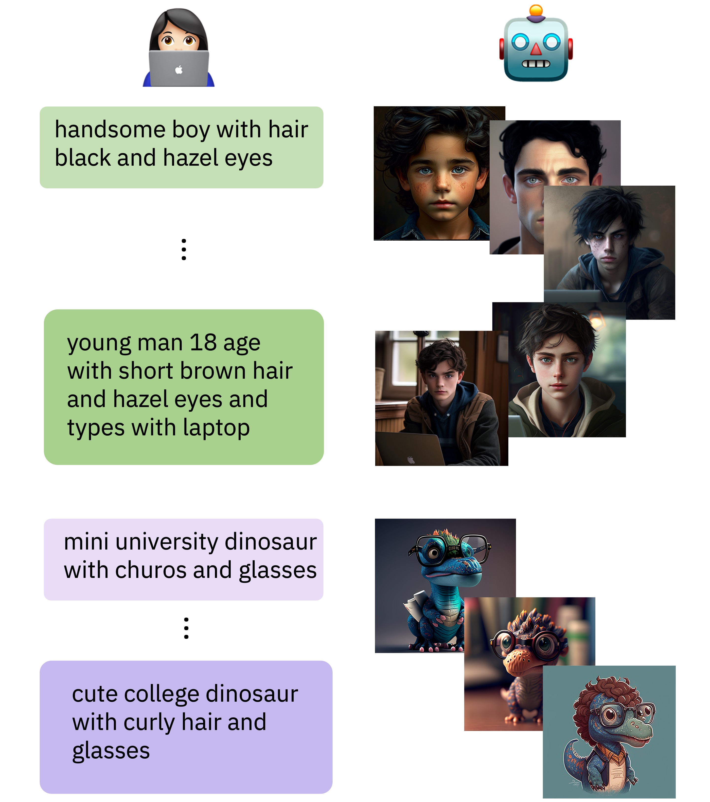

# Human Learning by Model Feedback: The Dynamics of Iterative Prompting with Midjourney

<p align="center">
  
</p>

The language people use when they interact with each other changes over the course of the conversation, as people dynamically adapt to each other. 

Will we see a systematic language change along the interaction of human users with a text-to-image model too? 

Generating images with a Text-to-Image model often requires multiple trials, where human users iteratively update their prompt based on feedback, namely the output image. Taking inspiration from cognitive work on reference games and dialogue alignment, we analyze the dynamics of the user prompts along such iterations. We compile a dataset of iterative interactions of human users with Midjourney. 

Paper link: http://arxiv.org/abs/2311.12131

---

Data
---
The dataset that was collected and used in this paper is available in the `data` folder.

The data is in a csv format, divided into 9 files (threads_i.csv for i in range(0, 9, 20000)).
It is also available as a Huggingface dataset [here][hf_data]

[hf_data]: https://huggingface.co/datasets/shachardon/midjourney-threads "markdown huggingface_dataset"

Main Columns:
- 'text' - the original prompt
- 'args' - predefined parameters (such as the aspect ratio, chaos and [more][myexample])
- 'channel_id' - the discord channel
- 'userid' - an anonymous user id
- 'timestamp' - a timestamp of the prompt creation
- 'label' - Ture whether an image that was generated based on that prompt was upscaled, otherwise False.
- 'id' - unique id of the prompt
- 'url_png' - link to the generated images (a 4-grid version)
- 'main_content' - prefix of the prompt, without trailing magic-words
- 'concreteness' - concreteness score, based on the [this paper][concpaper] 
- 'word_len' - the number of words
- 'repeat_words' - the occurrences of each word that appears more than once in the prompt, excluding stop words.
- 'reapeat_words_ratio' - repeat_words / word_len
- 'perplexity' - the perplexity GPT-2 assigns to each prompt.
- 'caption_0-3' - captions that were generated by the BLIP-2 model, with the 4 created images as its inputs.
- 'phase' - train/test split, as was used to train image/text classifiers
- 'magic_ratio' - the percentage of words that were recognized as magic words in the prompt
- 'thread_id' - the id of the thread
- 'depth' - the max depth of a constituency parse tree of the prompt.
- 'num_sent_parser' - the number of sentences in the prompt.
- 'num_sent_parser_ratio' - num_sent_parser / word_len
- 'words_per_sent' - word_len / num_sent_parser
- 
---

Code
---
The code for preparing the data is in the `prepare` folder.

---

Citiation
---
If you find this work useful, please cite our paper:

```
@misc{donyehiya2023human,
      title={Human Learning by Model Feedback: The Dynamics of Iterative Prompting with Midjourney}, 
      author={Shachar Don-Yehiya and Leshem Choshen and Omri Abend},
      year={2023},
      eprint={2311.12131},
      archivePrefix={arXiv},
      primaryClass={cs.CL}
}
