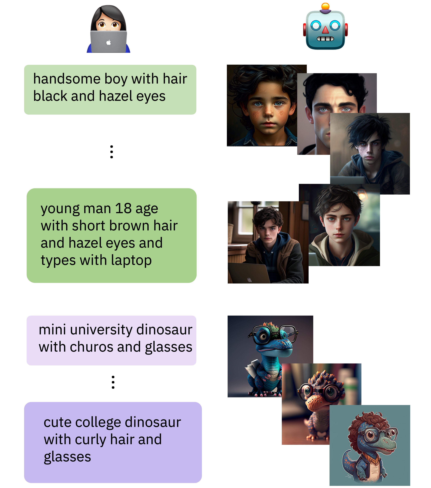

# Human Learning by Model Feedback: The Dynamics of Iterative Prompting with Midjourney

  

The language people use when they interact with each other changes over the course of the conversation, as people dynamically adapt to each other. 

Will we see a systematic language change along the interaction of human users with a text-to-image model too? 

Paper link: http://arxiv.org/abs/2311.12131

---
